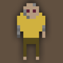

# @aberoth-community/mechagurun

> [🇺🇸](#aberoth-communitymechagurun) [🇧🇷](.github/README/pt-BR.md)

 

  

  A chat engagement bot for Aberoth!

## Usage:

### Requirements:

- [NodeJS v16+](https://nodejs.org/en)
- [pnpm](https://pnpm.io/installation#using-corepack) _(optional)_

### Installation:

- Setup your environment. `cp .env.example .env`
- Install dependencies. `npm run install`
- Start bot. `npm run start`
